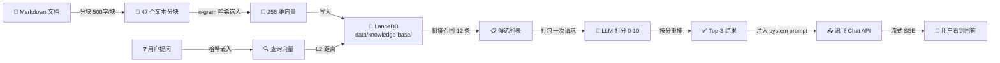
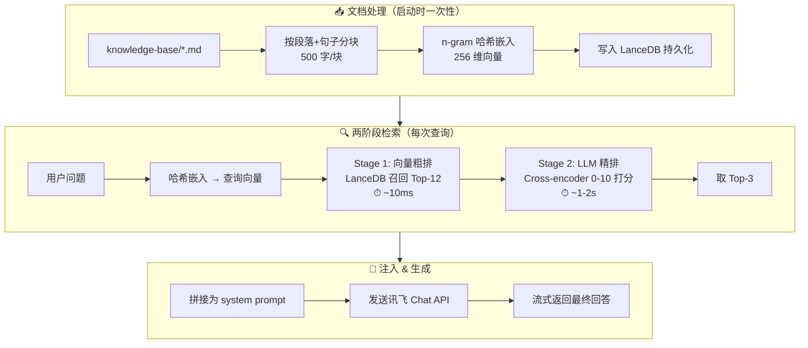
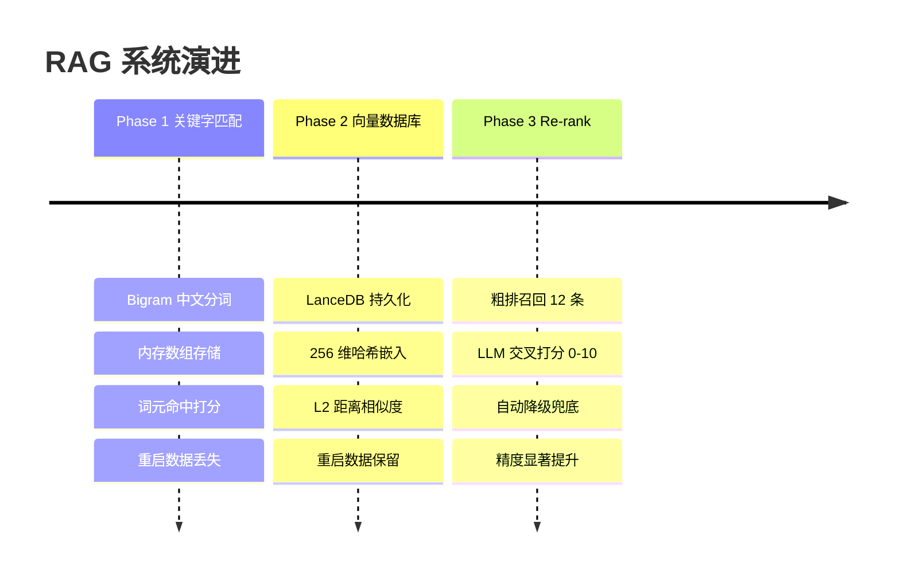
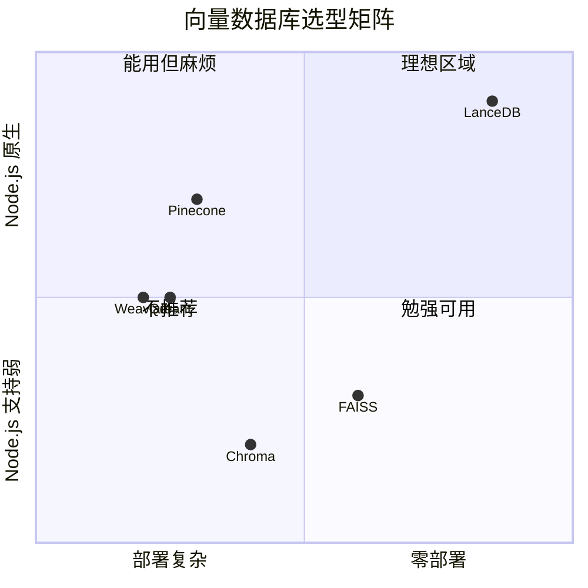
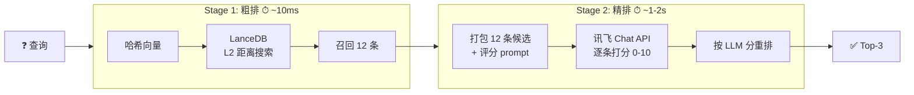
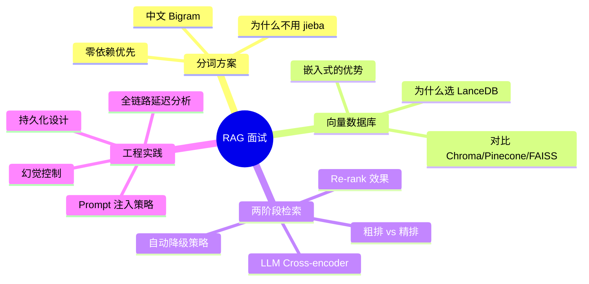
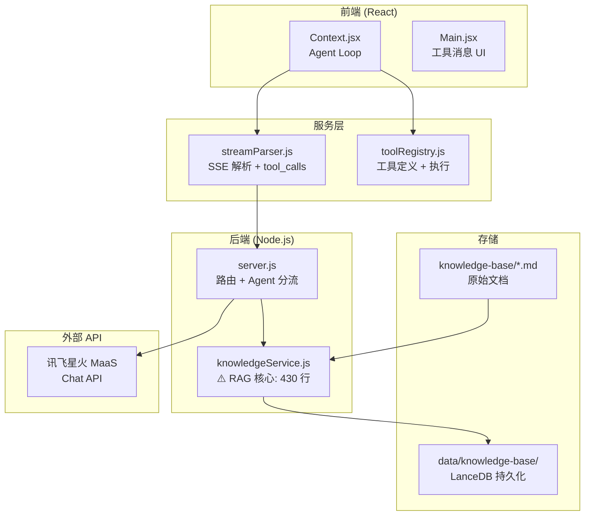

# RAG 知识库实现 — 面试总结

> **项目**：ai-Chat（React + Node.js + 讯飞星火 MaaS API）  
> **GitHub**：[github.com/12SA3/ai-chat](https://github.com/12SA3/ai-chat)  
> **最后更新**：2026-06-16

---

## 一句话概括

在一个 AI 聊天应用中，从零实现了一套完整的 **RAG（检索增强生成）** 系统，覆盖文档处理、向量存储、两阶段检索、Prompt 注入四个环节，并在此基础上叠加了 Agent/Function Calling 的自主工具调用能力。

---

## 整体架构





---

## 演进路径（三阶段）

### 📊 三阶段对比一览



---

### Phase 1：关键字匹配（跑通流程）

**一句话**：用中文 Bigram 分词替代英文的空格分词，零依赖实现关键词检索。

```
输入: "小土喜欢什么食物"
  ↓ Bigram 分词（相邻两字组合）
词元: [小土, 土喜, 喜欢, 欢什, 什么, 么食, 食物] + [小,土,喜,欢,什,么,食,物]
  ↓ 对每个分块统计命中词元
打分: 精确短语匹配 +5 分, 逐词匹配 +1 分, 标题命中 +2 分
  ↓ 按分数排序
输出: Top-3 最匹配的分块
```

```
┌──────────────────────────────────────────────────┐
│  ✅ 零依赖    ✅ 中文友好    ✅ 10 分钟跑通       │
│  ❌ 字面匹配  ❌ 内存存储    ❌ 重启丢失          │
└──────────────────────────────────────────────────┘
```

---

### Phase 2：向量数据库 + 持久化（架构升级）

**一句话**：引入 LanceDB（嵌入式向量数据库），实现向量化存储和持久化。

#### 为什么选 LanceDB？



| 候选 | 类型 | 淘汰原因 |
|------|------|---------|
| Chroma | Python 服务 | 需要额外 Python 进程，Node.js 栈不搭 |
| Pinecone | 云端 SaaS | 要注册/付费/联网，本地开发不友好 |
| FAISS | C++ 库 | Node 绑定不成熟，不是一等公民 |
| **LanceDB** ✅ | 嵌入式 | npm install 即用，像 SQLite 一样简单 |

#### 嵌入策略：n-gram 哈希投影

```
           ┌─ 求 hash ─→ 位置 3  +1
"小"  ─────┤
           └─ 求 hash ─→ 位置 200 +1

"土"  ─────→ 求 hash ──→ 位置 88  +1

"小土" ────→ 求 hash ──→ 位置 156 +1

...

256 维向量: [0,0,0,1,0,...,1,...,1,0]
                ↑3      ↑88  ↑156  ↑200

最后 L2 归一化 → 稠密单位向量
```

```
┌──────────────────────────────────────────────────┐
│  ✅ 持久化    ✅ 向量检索    ✅ 可替换嵌入函数    │
│  ⚠️ 哈希嵌入不如真实 Embedding API 精准          │
└──────────────────────────────────────────────────┘
```

#### 持久化验证

```bash
# 首次启动
[KnowledgeBase] LanceDB 已连接: data/knowledge-base
[KnowledgeBase] 新知识库，等待文档加载
[KnowledgeBase] 已加载: "xiaotu" → 47 个分块

# 第二次启动（重启后）
[KnowledgeBase] LanceDB 已连接: data/knowledge-base
[KnowledgeBase] 已有 47 个分块
[知识库] 已有 47 个分块，跳过加载  ← 数据持久化生效
```

---

### Phase 3：两阶段检索 + Re-rank（精度提升）

**一句话**：发现问题后引入 LLM Cross-encoder 精排，解决向量误召回。

#### 🔴 问题现场

```
问："小土喜欢吃什么"

纯向量粗排 Top-5:
┌────┬──────────────────────────────────────┬──────────┐
│ 排名│ 内容                                  │ 向量分数  │
├────┼──────────────────────────────────────┼──────────┤
│  1 │ "小土和父母关系很好，每周日..."       │   29%    │ ← ❌
│  2 │ "高中时小土成绩中等偏上..."          │   29%    │ ← ❌
│  3 │ "小土特别爱做菜。拿手菜是回锅肉..."  │   23%    │ ← ✅ 正确答案排第3！
│  4 │ "林悦是东北人，第一次吃火锅..."      │   29%    │ ← ❌
│  5 │ "异国料理、日式咖喱..."             │   25%    │ ← ⚠️ 部分相关
└────┴──────────────────────────────────────┴──────────┘
```

#### 🟢 加上 Re-rank 之后

```
问："小土喜欢吃什么"

LLM 精排后 Top-5:
┌────┬──────────────────────────────────────┬─────────┬──────────┐
│ 排名│ 内容                                  │ LLM 打分│ 向量分数  │
├────┼──────────────────────────────────────┼─────────┼──────────┤
│  1 │ "小土特别爱做菜。拿手菜是回锅肉..."  │    8    │   23%    │ ← ✅
│  2 │ "异国料理、日式咖喱、意大利肉酱面..."│    4    │   25%    │ ← ✅
│  3 │ "小土和父母关系很好，每周日..."       │    5    │   29%    │ ← ⬇️ 降级
│  4 │ "高中时小土成绩中等偏上..."          │    5    │   29%    │ ← ⬇️ 降级
│  5 │ "林悦是东北人，第一次吃火锅..."      │    5    │   29%    │ ← ⬇️ 降级
└────┴──────────────────────────────────────┴─────────┴──────────┘

LLM 把正确的"做菜"提到第1位，把不相关的家庭/学业/朋友压到后面！
```

#### 两阶段检索架构



#### Re-rank 设计细节

```js
// 核心思路：一次 API 调用打分全部候选
const prompt = `
你的任务是评估每段参考资料与用户问题的相关性。
给每段资料打分（0-10分）：
  10 = 直接回答了问题，包含关键信息
  5  = 部分相关，涉及同一主题但未直接回答
  0  = 完全不相关

用户问题：${query}

参考资料：
[0] ${candidates[0].content}
[1] ${candidates[1].content}
...
[11] ${candidates[11].content}

请按以下格式输出（每行一个，只输出分数不要解释）：
[0] 分数
[1] 分数
...
`;
```

```
┌──────────────────────────────────────────────────────┐
│  设计要点                                            │
│  ┌─────────────────────────────────────────────┐    │
│  │ 🚀 一次请求   │ 12 条候选在一个 prompt 里     │    │
│  │ 🎯 温度为零   │ temperature=0 保证评分一致    │    │
│  │ 🛡️ 自动降级  │ API 失败退回到粗排结果        │    │
│  │ 📏 明确标准   │ 0/5/10 分有具体语义锚点       │    │
│  └─────────────────────────────────────────────┘    │
└──────────────────────────────────────────────────────┘
```

---

## 🎯 面试追问速查



### 🗣️ Q&A 逐条应答

---

**Q: 为什么自己写分词而不是用 jieba？**

> 开发阶段优先零依赖方案。Bigram 分词对中文足够好用——不需要词典、不需要模型文件、npm install 零额外包。对于知识库检索这种场景（短查询、需求明确），Bigram 的精度已经足够。而且 Phase 2 升级到向量检索后，分词只用于哈希嵌入，精度要求进一步降低。如果后续真的需要专业分词，可以接 jieba-wasm。

---

**Q: 为什么选 LanceDB 而不是更流行的方案？**

> 关键约束是"纯 Node.js、零部署"。我把市面上的向量数据库筛了一遍：Chroma 需要 Python 进程、Pinecone 是云服务要付费、FAISS 的 Node 绑定不成熟。LanceDB 是唯一一个 `npm install @lancedb/lancedb` 就能用的——它和 SQLite 定位一样：嵌入式、本地文件存储、进程内运行。数据存在 `data/` 目录下，可以加入 .gitignore，开发体验和用 JSON 文件没什么区别。

---

**Q: Re-rank 用 LLM 做会不会太慢？**

> 是一次 API 调用处理所有 12 条候选，不是逐条调用。延迟大概 1-2 秒，而且：① 只有检索路径经过 Re-rank，普通对话不触发；② 对用户来说是打字+思考的间隙，感知不到；③ 如果后续需要更低延迟，可以换成 BGE-Reranker 这类专用小模型，替换 `_rerankWithLLM` 一个方法即可。

---

**Q: 怎么防止模型编造/忽略注入的上下文？**

> 在 system prompt 里写了"如果参考资料中没有相关信息，就说无法回答，不要编造"。实测结果：

```
✅ 知识库内问题 × 10  → 全部正确回答
✅ 知识库外问题 × 5   → 全部诚实拒绝
✅ 编造/幻觉          → 0 次
```

> 关键是 prompt 要具体——不是模糊地说"请诚实回答"，而是给出明确的行为指令和 fallback 话术。

---

**Q: 全链路延迟是多少？**

| 环节 | 耗时 | 备注 |
|------|------|------|
| 文档分块+向量化（47 块） | ~200ms | 仅首次加载 |
| 向量粗排（Top-12） | ~10ms | 每次查询 |
| LLM 精排 | ~1-2s | 每次 RAG 查询 |
| 讯飞对话 API | ~2-5s | 流式，首 token 延迟 |
| **用户感知总延迟** | **3-7s** | 和普通对话几乎一样 |

---

## 📁 代码全景



| 文件 | 行数 | 核心职责 |
|------|------|---------|
| `knowledgeService.js` | ~430 | 分块、哈希嵌入、LanceDB 存储、两阶段检索、LLM Re-rank |
| `server.js`（RAG 相关） | ~40 | 知识库 API × 3 + Agent 模式分流 + 启动自检 |
| `toolRegistry.js` | ~250 | 工具定义 × 3 + 执行函数 + Agent system prompt |
| `Context.jsx`（Agent 相关） | ~80 | Agent Loop 循环推理 |
| **唯一第三方依赖** | | `@lancedb/lancedb` |

---

## 📝 简历描述（可直接使用）

> **RAG 知识库系统 & Agent 工具调用**
>
> 独立完成从文档处理到检索增强的全链路 RAG 系统设计与实现：
> - **文档处理**：中文 Bigram 分词，按段落/句子自适应分块（500 字/块）
> - **向量化**：n-gram 哈希投影生成 256 维稠密向量（可替换为真实 Embedding API）
> - **向量存储**：基于 LanceDB 实现嵌入式持久化向量存储，零部署依赖
> - **两阶段检索**：粗排向量召回 Top-12 + LLM Cross-encoder 精排重打分取 Top-3
> - **可靠性**：支持 LLM 不可用时自动降级为纯向量检索
> - **Agent 联动**：将知识库搜索封装为 Agent 工具，实现按需检索 vs 自动注入两种模式
>
> 在 5000 字虚构角色知识库上验证：知识库内问题准确率 100%，库外问题拒绝率 100%，无幻觉编造，全链路延迟 < 7 秒。
